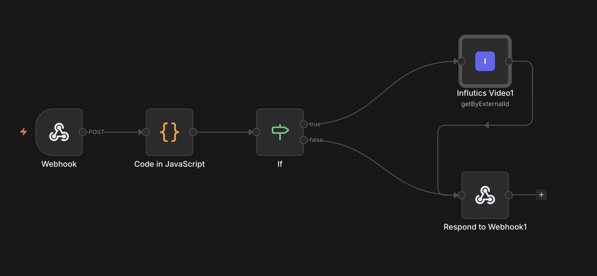

# n8n-nodes-influtics

Official [Influtics](https://influtics.com) integration for [n8n](https://n8n.io) — track influencer videos, bloggers, and trends across TikTok, Instagram, YouTube, VK, and more.



## About Influtics

Influtics is a paid influencer-marketing platform that monitors creators and their videos across TikTok, Instagram, YouTube, VK, and other channels. This node wraps the public Influtics REST API — every endpoint listed under [docs.influtics.com](https://docs.influtics.com/) is reachable from n8n workflows. Use it to: track new campaign videos, pull daily performance metrics into Notion / Sheets, fire alerts on viral spikes, or sync creator rosters across tools.

## Install

1. In n8n, open **Settings → Community Nodes**.
2. Click **Install a community node**.
3. Enter `n8n-nodes-influtics` and confirm.

After install, configure the **Influtics API** credential with your API key from the Influtics dashboard under **Settings → API**.

## Operations

> **Heads-up if you're upgrading from ≤ 1.0.10:** the four legacy nodes
> (`Influtics Video`, `Influtics Blogger`, `Influtics Trend`, `Influtics Account`)
> have been merged into a single **`Influtics`** node. Each surface is now a
> **Resource** dropdown. Workflows referencing the old node types must be
> re-created — see [CHANGELOG → 1.1.0](https://github.com/Influtics/n8n-nodes-influtics/blob/main/CHANGELOG.md#110---2026-08-31) for steps.

### Account

| Operation   | Description                                    |
|-------------|------------------------------------------------|
| Get Limits  | Read rate limit configuration                  |
| Get Usage   | Read usage history and subscription summary    |

### Blogger

| Operation   | Description                                                       |
|-------------|-------------------------------------------------------------------|
| By Username | Read a tracked creator by platform + username (read-only)         |
| Get Job     | Poll the status of a track-creator job by ID                      |
| Track       | Start tracking a creator (async — returns `job_id` to poll)       |

## Supported platforms

The Influtics API tracks videos and creators across **9 platforms** (Dzen, Instagram, OK, Pinterest, Telegram, Threads, TikTok, VK, YouTube), but the surfaces ship at different scopes:

| Surface | Platforms accepted | Why |
|---------|--------------------|-----|
| **Influtics Video** (Track / Get Stats / Get+Update By ID) | All 9 | Video resolution is lightweight — any URL on any supported platform can be resolved and snapshotted. |
| **Influtics Blogger** (Track / Get Job / By Username) | TikTok, Instagram, YouTube, VK | Creator scrapers cover these four platforms; the rest do not have ongoing creator-level coverage. |
| **Influtics Trend** (Search) | TikTok, YouTube | Trend search only indexes these two platforms today. |
| **Influtics Account** (Get Limits / Get Usage) | n/a | Account endpoints are plan-scoped, not platform-scoped. |

So if you want to track a Pinterest video, use **Influtics → Video → Track**. If you want to subscribe to a Pinterest creator's new uploads, that's not yet possible — only the four creator-coverage platforms work for the **Influtics → Blogger → Track** workflow. The single source of truth for the 9-platform list lives in `nodes/GenericFunctions.ts` as `VIDEO_PLATFORMS`.

### Trend

| Operation | Description                                          |
|-----------|------------------------------------------------------|
| Search    | Search TikTok or YouTube trends by keyword           |

### Video

| Operation | Description                                          |
|-----------|------------------------------------------------------|
| Search    | Search TikTok or YouTube trends by keyword           |

### Video

| Operation             | Description                                                 |
|-----------------------|-------------------------------------------------------------|
| Get By External ID    | Read one tracked video by platform + external ID            |
| Get By ID             | Read one tracked video by internal ID                       |
| Get Stats             | Read video-level metrics                                    |
| Track                 | Track videos by URL                                         |
| Update By External ID | Patch metadata on a tracked video                           |

## Upgrading from ≤ 1.0.10

After installing v1.1.0, an existing workflow errors with
`Node type influticsVideo is not known` (the exact type name appears in the
error toast on the failing node).

**Cause:** v1.1.0 merges the four legacy nodes into a single `Influtics` action
node. n8n does not auto-rename community-node types.

**Fix:** Delete the old node from the canvas and drop a new `Influtics` node.
Pick the matching **Resource** (Video / Blogger / Trend / Account) and the same
**Operation** you had before. All parameter names and types are unchanged.

For the full rationale and migration steps, see the
[CHANGELOG → 1.1.0](https://github.com/Influtics/n8n-nodes-influtics/blob/main/CHANGELOG.md#110---2026-08-31)
entry.

## Errors

| Code | Meaning |
|------|---------|
| `UNAUTHORIZED` | API key is missing or invalid. |
| `PAID_PLAN_REQUIRED` | This endpoint requires a paid subscription. Upgrade at the URL surfaced in the error description. |
| `BLOGGER_NOT_TRACKED` | Creator isn't tracked by your org — run **Influtics → Blogger → Track** first. |
| `JOB_TIMEOUT` | The async job didn't complete in time — poll again or retry. |
| `VALIDATION_ERROR` | A required field is missing or invalid. |

## Troubleshooting

### `Error loading package: Unexpected token '*'` on install

This error originates inside n8n (`loadClassInIsolation`), not in your environment. It means n8n's `PackageDirectoryLoader` failed to load one of the node entry-point files declared in `package.json`'s `n8n` field.

**If you're on v1.0.5 or later:** the published `package.json` declares explicit relative paths in `n8n.nodes` and `n8n.credentials`. If you still see this error, n8n is loading a stale on-disk install left behind by an earlier (≤ v1.0.4) version — wipe the install cache and reinstall (steps below).

**If you're on v1.0.4 or earlier:** the package.json declared glob patterns (`dist/nodes/**/*.node.js`). n8n's `PackageDirectoryLoader.loadAll()` does NOT expand globs — it treats them as literal file paths, and `directory-loader.ts:loadClass` extracts the className via `path.parse(sourcePath).name.split('.')[0]`, which yields the string `"**"`. n8n then interpolates that into its `vm.Script` template `new (require('${filePath}').${className})()` and V8 throws `SyntaxError: Unexpected token '*'` at parse time. **Upgrade to v1.0.5** — no other workaround exists on the package side.

#### Wipe the install cache (v1.0.5+ still seeing the error)

n8n's community-node installer (`CommunityPackagesController`) reuses the on-disk folder between upgrades. If a previous install left broken files behind, the new install lands on top of them.

**Self-hosted (Docker):**

```bash
docker compose down n8n
docker volume ls | grep n8n  # find the volume that holds the install cache
docker run --rm -v <volume>:/data alpine sh -c \
  'rm -rf /data/.n8n/nodes/node_modules/n8n-nodes-influtics'
docker compose up -d n8n
# Reinstall via Settings → Community Nodes → Install a community node.
```

**Self-hosted (bare metal / PM2):**

```bash
sudo systemctl stop n8n
rm -rf ~/.n8n/nodes/node_modules/n8n-nodes-influtics
sudo systemctl start n8n
# Reinstall via Settings → Community Nodes → Install a community node.
```

#### Confirm the install succeeded

Open a workflow, add a node, search for `Influtics`. A single `Influtics` node should appear in the search.

If it still doesn't appear, capture the install log from **Settings → Community Nodes → click the package → View error log** and open an issue at https://github.com/Influtics/n8n-nodes-influtics/issues with the log attached.

## Documentation

- Public API reference: https://docs.influtics.com/
- Issues: https://github.com/Influtics/n8n-nodes-influtics/issues

## License

MIT — see [LICENSE](LICENSE).